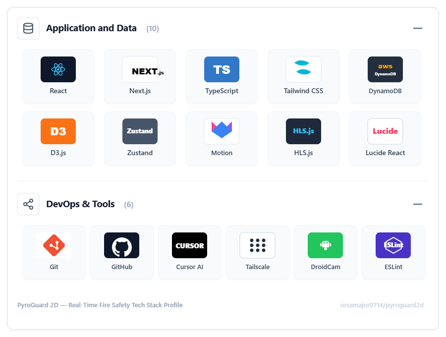
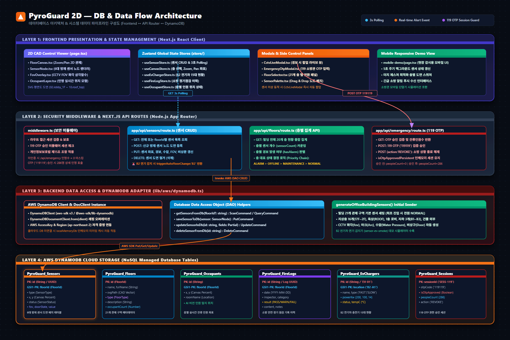
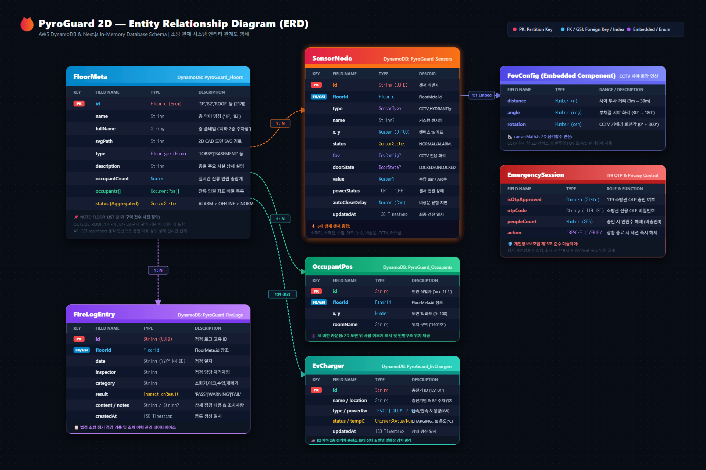

# PyroGuard 2D

**2D CAD 도면 위에서 빌딩 전체의 소방 설비를 실시간 관제하는 방재 시스템.**
지상 17층 / 지하 3층 오피스 빌딩을 대상으로, 164개 소방 노드의 상태를 한 화면에서 감시하고
119 출동 시 인명 위치를 OTP 인증으로 열람하는 흐름까지 구현했습니다.

> Next.js 16 App Router 단일 코드베이스로 프론트엔드와 REST API를 함께 구성한 1인 개발 프로젝트입니다.



---

## 이 프로젝트에서 풀고 싶었던 문제

소방 관제 화면은 **평시에는 아무 일도 일어나지 않다가, 화재가 나는 순간 모든 정보가 필요해지는** 시스템입니다.
그래서 두 가지를 설계의 축으로 잡았습니다.

- **평시에는 개인정보를 완전히 가린다.** 재실자 위치는 기본적으로 마스킹되며, 119 OTP 승인 이후에만 해독됩니다. 상황 종료(REVOKE) 시 즉시 다시 마스킹됩니다.
- **비상시에는 층을 옮겨 다니지 않고 파악할 수 있어야 한다.** 그래서 평면 도면(2D)과 건물 전체 조감도(2.5D) 두 가지 시점을 두고 전환하도록 만들었습니다.

## 주요 기능

| 기능 | 내용 |
|---|---|
| **2D 도면 관제** | 1200×800 SVG 좌표계 위에 소화기·옥내소화전·아크차단기·CCTV·비상구·수압계 노드를 배치. `getScreenCTM()` 좌표 역변환으로 드래그 앤 드롭 자유 배치 |
| **2.5D 건물 조감도** | CSS `perspective` + `rotate`로 21개 구역의 경보 상태를 수직으로 한눈에 조망 |
| **CCTV 시야각(FOV)** | 삼각함수 기반 부채꼴 렌더링. 거리 1m·화각 15°·회전 45° 단위 스냅 조작 |
| **라이브 비디오월** | hls.js / iframe 기반 2×2, 3×3, 4×4 다채널 모니터링 및 채널별 0/90/180/270° 회전 보정 |
| **119 OTP 인명 관제** | 6자리 OTP 검증 승인 시에만 층별 재실 인원 표출, 구조 완료 처리 |
| **B2 EV 충전기 / 점검 이력** | 지하주차장 충전기 15대 상태 관리, 소방점검 이력 다중 필터 검색 |

🎥 CCTV 라이브 피드 시연 영상: [`CCTV 시연 영상.mp4`](CCTV%20%EC%8B%9C%EC%97%B0%20%EC%98%81%EC%83%81.mp4)

## 기술 스택

| 영역 | 사용 기술 | 선택 이유 |
|---|---|---|
| 프레임워크 | Next.js 16.2 (App Router) | 프론트와 REST API를 한 저장소에서 운영 |
| UI | React 19.2 / TypeScript 5 | 컴포넌트 단위 갱신, 정적 타입으로 센서 상태 오류 차단 |
| 상태 관리 | Zustand | 도메인별 5개 스토어로 분리해 불필요한 리렌더링 억제 |
| 캔버스 | D3-Zoom / D3-Selection | `viewBox` 기반 0.5x~5.0x 줌·팬 |
| 스트리밍 | hls.js / iframe | IP 카메라 및 모바일 카메라 피드 연동 |
| 스타일 | Tailwind CSS 4 / Framer Motion | 모달 전환 및 경보 애니메이션 |

## 아키텍처

**상태 관리 (Zustand 5개 스토어)**

```
useCanvasStore    뷰 모드(BUILDING/CANVAS) · 선택 층 · 줌 배율 · 활성 모달
useSensorStore    164개 센서 CRUD · 활성 경보 수 집계
useOccupantStore  119 인명 구조 완료 목록 · 층별 클리어 상태
useEvChargerStore B2 EV 충전기 15대 상태
useFireLogStore   소방점검 이력 로그 · 필터링
```

**REST API**

| 엔드포인트 | 메서드 | 기능 |
|---|---|---|
| `/api/sensors` | GET / POST / PUT / DELETE | 센서 조회·배치·상태 변경·철거 (B2 화재 감지 트리거 연동) |
| `/api/floors` | GET | 20개 층 대표 상태 집계 (ALARM > OFFLINE > MAINTENANCE > NORMAL) |
| `/api/emergency` | GET / POST | 119 OTP 승인 검증 및 인명 정보 반환 / 세션 해제 |

상세 요청·응답 규격은 [`API_기능_정의서.txt`](API_기능_정의서.txt) 참고.




## 실행 방법

```bash
npm install
npm run dev
```

http://localhost:3000 접속. 모바일 데모 화면은 `/mobile-demo`.

> 데이터는 외부 클라우드 의존 없이 인메모리 저장소로 동작하므로 별도 DB 설정이 필요 없습니다.
> 119 인명 정보 열람 OTP는 데모용으로 `119119` 입니다.

## 프로젝트 문서

| 문서 | 내용 |
|---|---|
| [`기획서.txt`](%EA%B8%B0%ED%9A%8D%EC%84%9C.txt) | 구축 대상·예산·요구사항 정의 |
| [`아키텍처 구조.txt`](%EC%95%84%ED%82%A4%ED%85%8D%EC%B2%98%20%EA%B5%AC%EC%A1%B0.txt) | 디렉터리 및 모듈 구조 |
| [`전체 구조 및 기능 리뷰 - 한글요약본.txt`](%EC%A0%84%EC%B2%B4%20%EA%B5%AC%EC%A1%B0%20%EB%B0%8F%20%EA%B8%B0%EB%8A%A5%20%EB%A6%AC%EB%B7%B0%20-%20%ED%95%9C%EA%B8%80%EC%9A%94%EC%95%BD%EB%B3%B8.txt) | 기능·로직 종합 요약 |
| [`구현 로드맵.txt`](%EA%B5%AC%ED%98%84%20%EB%A1%9C%EB%93%9C%EB%A7%B5.txt) | 단계별 구현 순서 |
