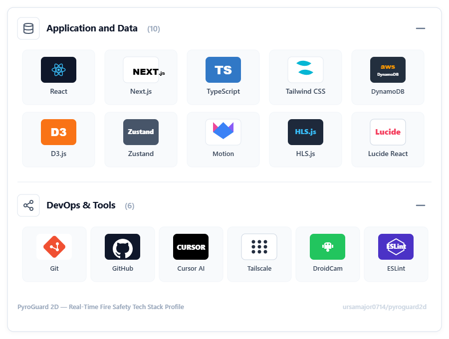
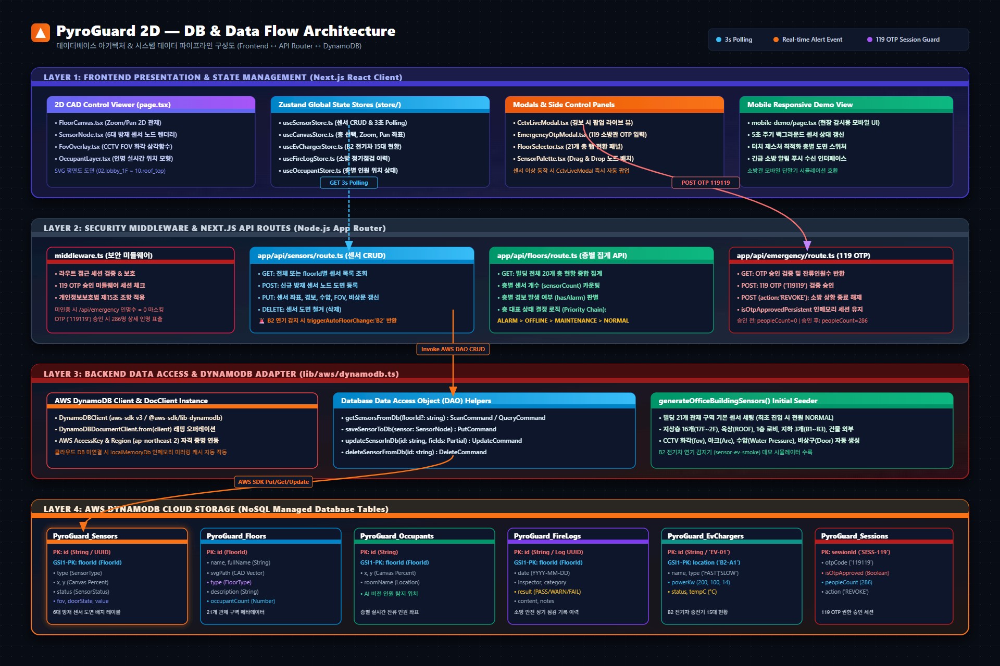
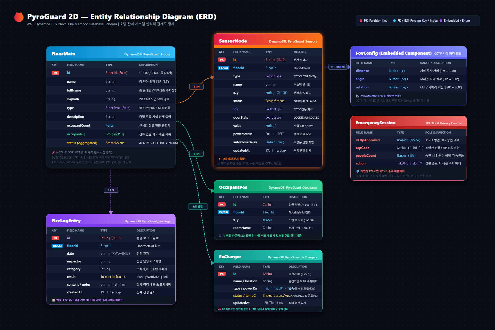

# PyroGuard 2D

2D CAD 도면 위에서 빌딩 소방 설비를 실시간 관제하는 방재 시스템입니다.
지상 17층 / 지하 3층 / 옥상 / 외부 — 22개 관제 구역, 92개 소방 노드를 한 화면에서 감시하고 119 출동 시 인명 위치를 연동합니다.

🎥 [CCTV 라이브 피드 시연 영상](CCTV%20%EC%8B%9C%EC%97%B0%20%EC%98%81%EC%83%81.mp4)



## 스택

Next.js 16 (App Router) · React 19 · TypeScript 5 · Zustand · D3-Zoom · Tailwind CSS 4 · Framer Motion · Vitest

프론트와 REST API를 한 저장소에서 운영하고, 외부 DB 없이 서버의 JSON 파일(`DATA_DIR/sensors.json`)에 센서 배치를 저장합니다.

## 주요 기능

| 기능 | 구현 방법 |
|---|---|
| 2D 도면 관제 | 1200×800 SVG 좌표계, `getScreenCTM()` 역변환으로 센서 노드 드래그 배치 |
| 2.5D 건물 조감도 | CSS `perspective` + `rotate`로 22개 구역 경보 상태 조망 |
| CCTV 시야각(FOV) | 삼각함수 기반 부채꼴 렌더링, 거리·화각·회전 스냅 조작 |
| 라이브 비디오월 | iframe 기반 2×2~4×4 다채널(https 스트림만), 채널별 90° 단위 회전 보정 |
| 119 인명 관제 | 평시 위치 비공개, 경보 중 6자리 OTP 승인 후 **그 단말에만** 제한 시간 동안 공개 · 종료/만료 시 즉시 재마스킹 |
| EV 충전기 / 점검 이력 | B2 충전기 15대 상태 관리, 소방점검 이력 다중 필터, B2 화재 시 도면 자동 전환 |

## 보안·개인정보

- **운영자 로그인** — 모든 화면과 API는 로그인 후에만 열립니다(`proxy.ts` + 각 라우트에서 재확인). 세션은 서명된 HttpOnly 쿠키.
- **119 승인** — 승인은 요청한 단말(세션)에만, `APPROVAL_TTL_MINUTES`(기본 30분) 동안만 유효합니다. 경보가 없는 평시에는 승인하지 않고, 5번 연속 틀리면 5분 잠깁니다.
- **재실자 위치** — 서버 전용 모듈(`lib/server/occupants.ts`)에만 있고, 승인된 단말의 `GET /api/emergency` 응답에만 실립니다. 화면 번들에는 없습니다.
- **감사 로그** — 로그인, OTP 승인·실패·해제, 센서 변경을 `DATA_DIR/audit.log`(JSONL)에 남깁니다.
- **헤더** — CSP·HSTS·X-Frame-Options 등(`next.config.ts`), CORS는 같은 출처 + `CORS_ALLOWED_ORIGINS`.

## 구조

```
app/api/        REST API — auth · sensors(CRUD) · floors(상태 집계) · emergency(OTP) · health
app/login/      운영자 로그인 화면
proxy.ts        로그인 게이트 · CORS · https 리다이렉트
lib/server/     서버 전용 — 세션 · 119 승인 · 입력 검증 · 센서 저장소 · 감사 로그 · 재실자
lib/client/     화면 → API 호출 공통
components/     canvas · modals · sidebar · common
store/          Zustand 5개 — canvas · sensor · occupant · evCharger · fireLog
tests/          Vitest
```




## 실행

```bash
npm install
cp .env.example .env.local     # OPERATOR_PASSWORD · SESSION_SECRET · EMERGENCY_OTP 를 채운다
npm run dev
```

http://localhost:3000 → 운영자 로그인 · 모바일 데모 `/mobile-demo` · OTP 는 `.env.local` 의 `EMERGENCY_OTP`

| 환경변수 | 필수 | 설명 |
|---|---|---|
| `OPERATOR_PASSWORD` | ✓ | 관제실 운영자 로그인 비밀번호 |
| `SESSION_SECRET` | ✓ | 세션 서명 키 (16자 이상 무작위, 예: `openssl rand -base64 32`) |
| `EMERGENCY_OTP` | ✓ | 119 OTP 6자리 |
| `APPROVAL_TTL_MINUTES` | | 119 승인 유지 시간 (기본 30) |
| `SESSION_TTL_HOURS` | | 로그인 유지 시간 (기본 12) |
| `CORS_ALLOWED_ORIGINS` | | 다른 출처에서 API 를 부를 주소 (쉼표 구분) |
| `DATA_DIR` | | 센서 배치·감사 로그 폴더 (기본 `.data`) |

## 검사

```bash
npm run lint        # ESLint
npm run typecheck   # tsc --noEmit
npm test            # Vitest — 검증 · 세션/승인 · 저장소 · 라우트 핸들러 · 화면 스토어 · KST
npm run build
```

GitHub Actions(`.github/workflows/ci.yml`)가 push·PR 마다 위 네 가지와 `npm audit`(운영 의존성)을 돌리고, Dependabot 이 의존성 업데이트를 매주 올립니다.
외부 품질 측정은 QA 레포의 `nextjs` 도구로 합니다 — 결과와 수정 기록은 [`docs/`](docs/)에 있습니다.

## 운영

- **상태 확인** — `GET /api/health` (로그인 불필요, 데이터 없음). 설정 누락이면 503. 업타임 감시에 등록합니다.
- **백업** — `npm run backup` → `backups/pyroguard-data-<KST 시각>.tar.gz` (최근 30개 유지). 복구는 서버를 멈추고 `DATA_DIR` 에 풀어 넣습니다.
- **배포 형태** — 저장소가 파일 하나라 **서버 1대(인스턴스 1개)** 로 운영합니다. 여러 인스턴스·서버리스로 나누려면 저장소를 DB 로 바꿔야 합니다. 119 승인은 서버 메모리에 있어 재시작하면 모두 풀립니다(안전한 쪽).

## 문서

[기획서](%EA%B8%B0%ED%9A%8D%EC%84%9C.txt) · [아키텍처 구조](%EC%95%84%ED%82%A4%ED%85%8D%EC%B2%98%20%EA%B5%AC%EC%A1%B0.txt) · [API 기능 정의서](API_%EA%B8%B0%EB%8A%A5_%EC%A0%95%EC%9D%98%EC%84%9C.txt) · [전체 기능 리뷰](%EC%A0%84%EC%B2%B4%20%EA%B5%AC%EC%A1%B0%20%EB%B0%8F%20%EA%B8%B0%EB%8A%A5%20%EB%A6%AC%EB%B7%B0%20-%20%ED%95%9C%EA%B8%80%EC%9A%94%EC%95%BD%EB%B3%B8.txt) · [수정사항 기록](%EC%88%98%EC%A0%95%EC%82%AC%ED%95%AD%EA%B8%B0%EB%A1%9D.txt)
